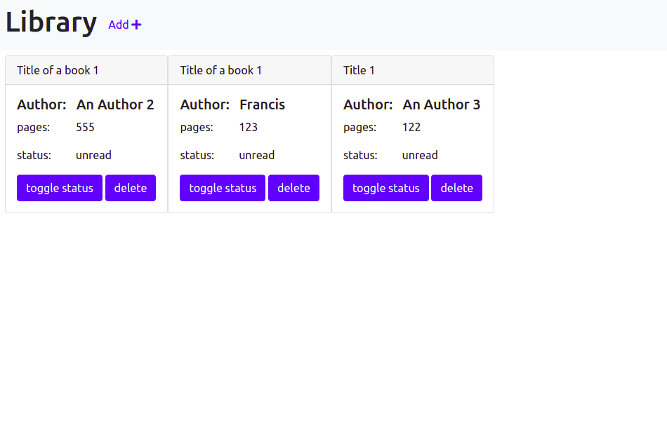

# Library

> A Library simulation. Users can create and delete books. They can mark a book as either read or unread. It uses localStorage to persist books



## Built With

- JavaScript
- HTML
- SCSS

## Getting Started

To get a local copy up and running follow these simple example steps on the command line.

```bash

  # Clone the project from it's github repo.

  $ git clone https://github.com/chasscepts/library

  # Change directory to the root of project

  $ cd library

  # Install all dev dependencies

  $ npm install


```

## Authors

👤 **Obetta Francis**

[](https://github.com/chasscepts) [](https://twitter.com/chasscepts) [](https://www.linkedin.com/in/chasscepts/)

👤 **Fares Ashraf**

[](https://github.com/ashraffares) [](https://twitter.com/Fares09301164) [](https://www.linkedin.com/in/faresashraf/)

## 🤝 Contributing

Contributions, issues, and feature requests are welcome!

Feel free to check the [issues page](https://github.com/chasscepts/library/issues).

## Show your support

Give a ⭐️ if you like this project!

## Acknowledgments

- Microverse Community
- Everyone whose code was used in this project

## 📝 License

This project is [MIT licensed](./LICENSE)
